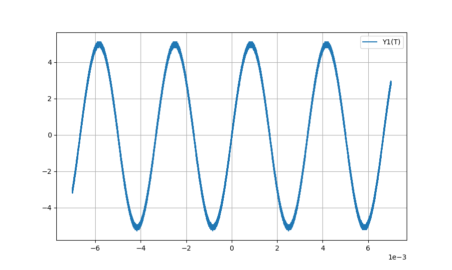

# SDS1104X-E_socket_waveform
#### Python script to pull wavefrom data from an SDS1104X-E / SDS1202X-E / SDS1204X-E oscillosope and display it

As I mention in a comment in the code, I am no Python programmer and the code is heavily based on the two Python examples from [here](https://www.siglenteu.com/wp-content/uploads/dlm_uploads/2017/10/ProgrammingGuide_PG01). I just combined them and fixed all the bugs.

Example plot I made with my SDS1104X-E:

